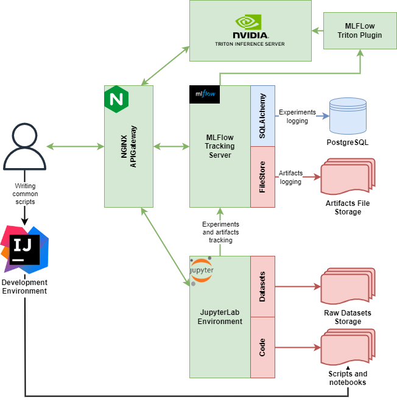

ML Environment
==============

Description
-----------
There is DevOps environment for Data Science and Machine Learning. The aim is to make easier my life (or yours). It allows you to run the environment in a remote server and work in the browser.

Architecture
------------

Installation
------------

1. [Install Docker](https://docs.docker.com/install/linux/docker-ce/ubuntu/)
2. [Install Docker-Compose](https://docs.docker.com/compose/install/)
3. [Install Git](https://git-scm.com/book/en/v2/Getting-Started-Installing-Git)
4. `cd /path/what/you/want`
5. `git clone https://github.com/AlKuz/MLEnvironment.git`
6. `cd MLEnvironment`
7. `docker-compose up`
8. Use port 5000 for MLFlow and 8888 for Jupyter-Lab

Jupyter-lab Extensions
----------------------
1. [jupyterlab-git](https://github.com/jupyterlab/jupyterlab-git)
2. [ipyleaflet](https://github.com/jupyter-widgets/ipyleaflet)
3. [variableinspector](https://github.com/lckr/jupyterlab-variableInspector)
4. [jupyterlab-toc](https://github.com/jupyterlab/jupyterlab-toc)
5. [jupyterlab-drawio](https://github.com/QuantStack/jupyterlab-drawio)
6. [Material Darker JupyterLab Extension](https://github.com/oriolmirosa/jupyterlab_materialdarker)

Main ML/DS python packages
---------------
1. [HDF5](https://www.hdfgroup.org/solutions/hdf5/)
2. [Keras](https://keras.io/)
3. [MLFlow](https://www.mlflow.org/docs/latest/index.html)
4. [Matplotlib](https://matplotlib.org/)
5. [NLTK](https://www.nltk.org/)
6. [Numba](http://numba.pydata.org/)
7. [Numpy](https://numpy.org/)
8. [Pandas](https://pandas.pydata.org/)
9. [Pillow](https://pillow.readthedocs.io/en/stable/installation.html)
10. [PyTorch](https://pytorch.org/)
11. [Scikit-image](https://scikit-image.org/)
12. [Scikit-learn](https://scikit-learn.org/stable/)
13. [Scipy](https://www.scipy.org/)
14. [Seaborn](https://seaborn.pydata.org/)
15. [Tensorflow](https://www.tensorflow.org/)
16. [tqdm](https://tqdm.github.io/)
17. [XGBoost](https://xgboost.readthedocs.io/en/latest/python/python_intro.html)
